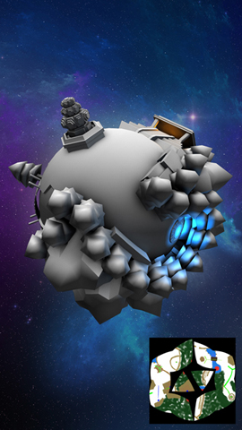
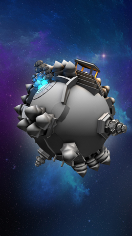

# Past Projects

##Details
###Description	
I began my journey into the games industry as a 3D artist. These are two of the titles I worked on from conception to launch while I was a part of the development team at Outsmart Games.
###Tools
Maya, Unity, Photoshop
###Tasks (Roost Riders)
Level Design, 3D Assets, Texturing, Unity Level Creation
###Tasks (Gopher Launch)
3D Assets, Texturing
###For
Outsmart Games
###Role
3D Artist
##Roost Riders
My time working on Roost Riders was divided between level design and asset creation.
The creation of objects, props, and their textures was shared between one additional artist and myself. Concepts were draw up for all assets by our teams concept artist.
I had the sole responsibility of designing and creating the level tracks. Tracks were created by building pieces up in Maya that could be arranged in different designs to formulate a range of different track segments.
Track segments then had assets place upon them to form obstacles of varying difficulty. Unity gave the freedom to manipulate and place our assets in many different arrangements. This allowed for some very unqiue level design.
###Launch Trailer

###Screenshots

Screenshots from final game marketing.

##Gopher Launch
The most enjoyable tasks I worked on for Gopher launch was providing a solution for the creation of the planets, their textures and their layouts.
Planets were made up for three different sections. An inner layer, outter layer, and walls. Both the inner and outter layers shared the same texture and UV space. While the walls only require one tilable texture per quad.
Working with the projects primary programmer who was experienced with Maya allowed me to share with him the techniques that he could use to quickly build different level layouts without having to worry about breaking textures/UVs.
###Launch Trailer

###Screenshots

Screenshots from final game marketing.

####Proof of Concept

First pass grey box levels I created as a proof of concept during the teams preproduction stage.

