# Past Projects

##Description	
I began my journey into the games industry as a 3D artist. These are two of the titles I worked on from conception to launch while I was a part of the development team at Outsmart Games.
###Tools
Maya, Unity, Photoshop
###Tasks (Roost Riders)
Level Design, 3D Assets, Texturing, Unity Level Creation
###Tasks (Gopher Launch)
3D Assets, Texturing
###For
Outsmart Games
###Role
3D Artist
##Roost Riders
###Launch Trailer

###Screenshots
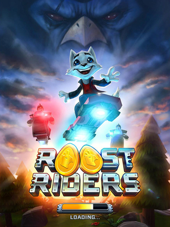
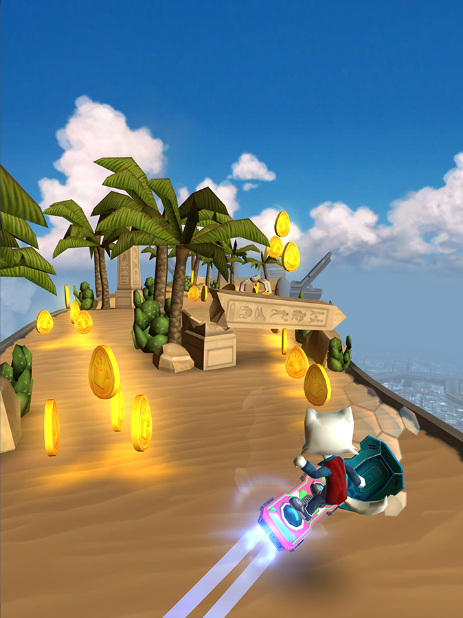
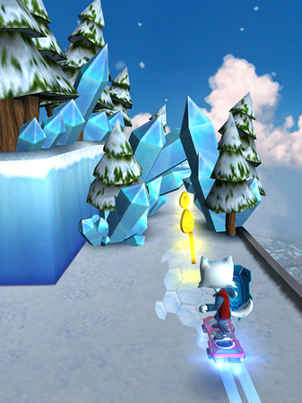
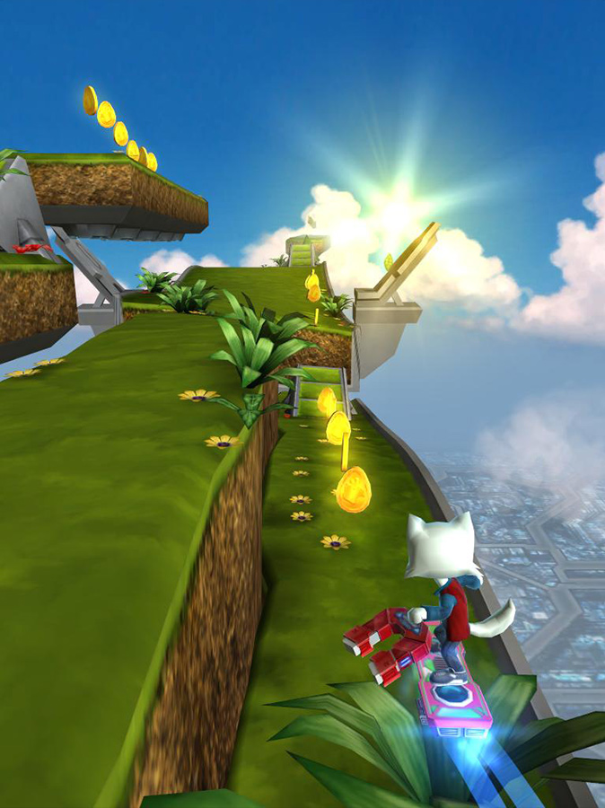
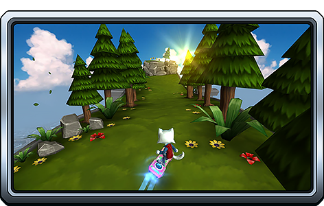
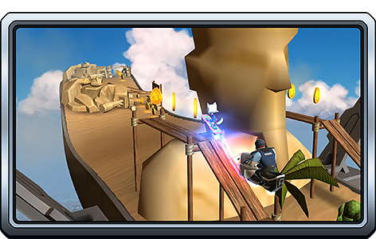
##Gopher Launch
###Launch Trailer

###Screenshots
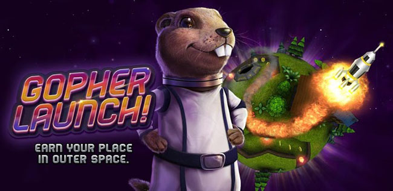
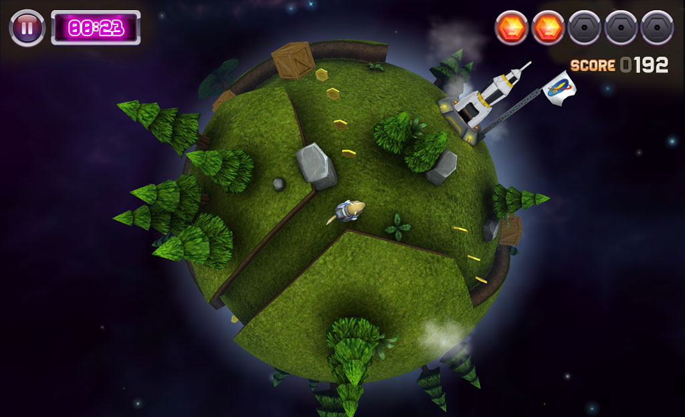
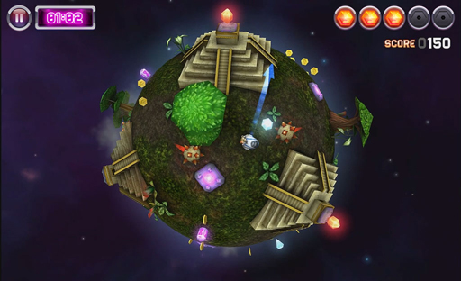
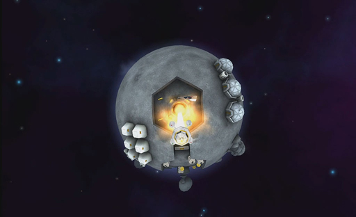
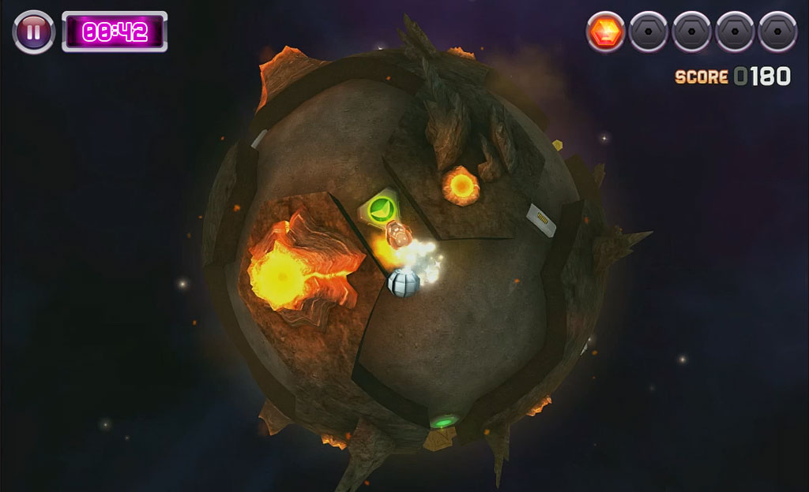
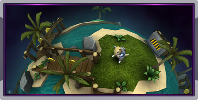